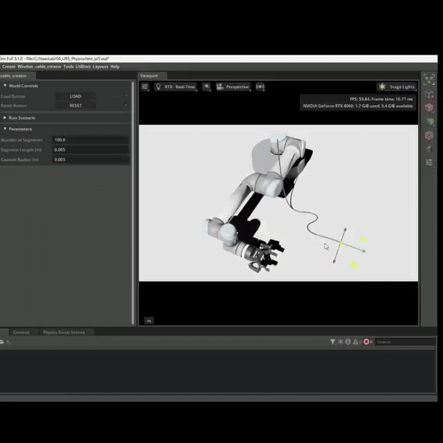

# IsaacSim-Cable-Creator
IsaacSim extension that insert a chain of capsules with 6d joints simulating cables.

# Usage

To enable this extension, run Isaac Sim with the flags --ext-folder {path_to_ext_folder} --enable {ext_directory_name}

